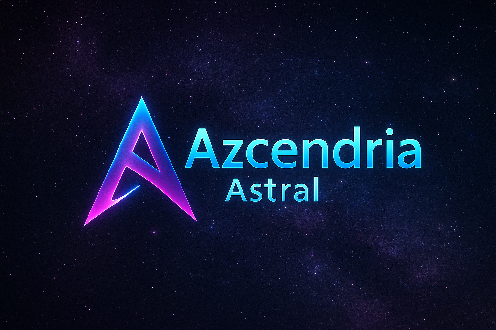

<h1 align="center">CHRISTIAN A. GINES</h1>

Cybersecurity · Network Defense · AI Systems · Tech Sales Strategy

Cebu City, Philippines — Open to Remote (US / UK Time Zones)

---

## 🌍 About Me

I build, secure, and scale real-world systems.

For 20+ years, I’ve led high-stakes operations — from telecom infrastructure deployments to revenue leadership for U.S. clients — and today, I merge that experience with **cybersecurity**, **network defense**, and **AI-driven intelligence systems**.

I specialize in:

- **Cyber defense & network forensics**
- **AI-assisted reconnaissance (ARRIA)**
- **Red-team methodologies & adversarial thinking**
- **Enterprise-level negotiation & B2B sales strategy**
- **Technical evangelism for cybersecurity & cloud products**

My goal is simple:

> Turn complex technologies into systems that are secure, understandable, and easy for organizations to adopt.

---

## 🚀 Azcendria Astral

**Global Workforce Accelerator · Digital Skills Engine · Talent Intelligence Platform**  
**Tagline:** *Where Skills Speak Louder than Resumes*

Azcendria Astral builds a secure, AI-augmented talent ecosystem that accelerates engineers, analysts, and technical professionals into global-standard careers.

We unify training, intelligence frameworks, employer pipelines, and real-world execution into one integrated system.

### Chemo Safe Language (Official Positioning)

Azcendria Astral develops proprietary automation frameworks, intelligence workflows, and educational architectures.  
Our internal AI tools (including “Kimo De Cinco”) are **branding and workflow concepts only** — built on top of licensed, third-party AI platforms.  

- We do **not** imply ownership of, partnership with, or endorsement by any AI vendor (e.g., OpenAI, Anthropic, etc.).  
- All prompts, playbooks, and methods are independently created internal assets of **Azcendria Astral**.  
- Students, employers, and partners always remain in control of their own data, tools, and accounts.

---

## 🤖 ARRIA — Artificial Reconnaissance & Research Intelligence Agent

ARRIA is a private R&D initiative focused on:

- AI-assisted reconnaissance and threat surface mapping  
- Vulnerability analysis and network-risk detection  
- Human-centric cyber-behavior analysis  
- Personal defense and device-hardening workflows  
- Modular intelligence pipelines for students & engineers  

ARRIA’s design:

> **Human first. AI-augmented. Security always.**

---

## 💼 Sales Systems Engineering

I treat sales like an engineering discipline.

My playbooks & systems cover:

- SDR & BDR **pipeline acceleration**
- **Full assumptive closing** with value-driven consultative sales
- Technical sales for **cybersecurity SaaS** and infrastructure
- Enterprise account strategy for **U.S. B2B + BPO + enterprise** clients
- Multi-channel activation (email, CRM, social, voice)

Blending security understanding with sales psychology is my competitive edge.

---

## 📂 Repositories (active development)

These repos are being built out in phases. Code, labs, and frameworks will roll out incrementally.

### 🔐 `arria-intelligence-agent`
Early-stage architecture and experiments for the **ARRIA** framework — AI-assisted reconnaissance, cyber-intelligence workflows, and defensive automation.

### 🌌 `azcendria-astral`
Core models, data structures, and process automation for **Azcendria Astral** — a global workforce accelerator and talent-intelligence platform where *skills* matter more than resumes.

### 🛡️ `cysec-labs`
Hands-on cybersecurity labs, packet captures, network-defense experiments, and incident-response drills used for training and self-development.

### 📈 `sales-systems-engineering`
My playbooks, tools, and simulations for high-performance sales teams — B2B, BPO, and enterprise accounts — combining pipeline math with real-world objection handling.

---

## 🧰 Tech & Tools

Some of the technologies I work with:

- **Security:** Suricata, Zeek, Wireshark, Nmap, Burp Suite  
- **Infra & OS:** Linux, pfSense, Docker, basic cloud (AWS / GCP)  
- **Networking:** VLANs, VPNs, firewalls, routing, packet analysis  
- **AI & Automation:** Python, API integrations, prompt-driven agents  
- **Sales Stack:** CRM systems, outbound sequencing, analytics dashboards  

---

## 📫 Contact

**LinkedIn:** https://linkedin.com/in/christian-gines-cysec  
**Email:** proteger.c-gines@proton.me  
**Website:** https://azcendria.com *(coming soon)*  

---

<i>Where Skills Speak Louder than Resumes — Azcendria Astral</i>

